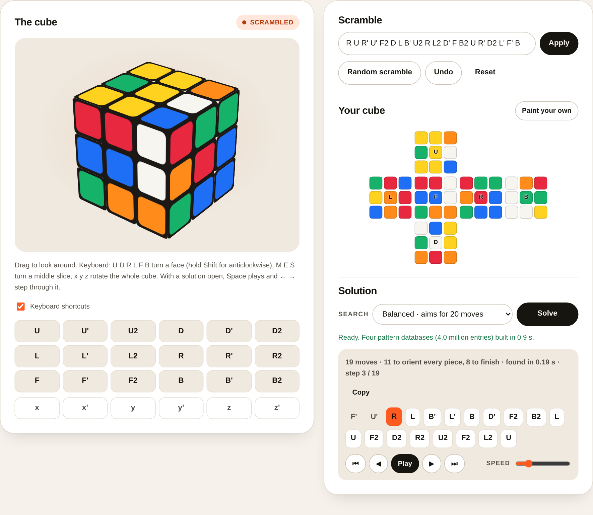

# Rubik's Cube Solver

**Live: <https://harjotst.github.io/rubiks-cube-solver/>**

Solve any 3×3×3 Rubik's cube in about twenty moves, entirely in the browser.
Scramble the 3D cube or paint in the colours of the one on your desk, press
Solve, and step through the answer.

No frameworks, no build step, no server. The page is plain HTML, CSS and
JavaScript modules; the solver runs in a Web Worker and generates its own
lookup tables in about a second when the page loads.



## What it does

- **An interactive 3D cube** drawn with CSS transforms. Drag to look around,
  click the move buttons, or use the keyboard: `U D R L F B` (hold Shift for
  anticlockwise), `x y z` for whole-cube rotations, `M E S` for slices. Every
  turn is animated, and a cube that has been rotated as a whole is still
  recognised as solved and still solvable.
- **Scrambles in standard notation**, including wide moves (`Rw` or `r`),
  slice moves and rotations, or a random 25-move scramble at the press of a
  button. The scramble goes into the URL, so a position can be shared.
- **Paint your own cube** on the unfolded net. If the cube you painted cannot
  exist, the page says exactly why: the wrong number of stickers of a colour,
  a piece that is not a real piece, a twisted corner, a flipped edge, or two
  pieces swapped.
- **Solve** at one of three effort levels, then play the solution back move by
  move, jump to any step, or copy it.

## How the solver works

The original (2024) version of this project was Korf's optimal algorithm,
written in C++ with Python scripts to generate its heuristics: iterative
deepening A* over a sticker-level cube model, guided by three pattern
databases. That is a fine algorithm, but its databases held 173 million
entries, took hours to generate, and needed gigabytes of memory, none of
which fits in a browser tab.

The port keeps every part of that design and rearranges it into Kociemba's
two-phase algorithm, which uses the same machinery on two much smaller
problems.

1. **Sticker model** (`src/cube.js`). The cube is 54 stickers on six 3×3
   faces, turned by the original's four primitive operations (rotate a face,
   a row, a column, a front/back layer). Each of them is run once against an
   identity-labelled cube to derive a permutation per move, so applying a move
   is a single 54-element gather.
2. **Cubie model** (`src/cubies.js`). The stickers are read into where each
   of the 8 corners and 12 edges sits and how it is twisted or flipped. The
   moves at this level are derived from the sticker model rather than typed
   in, and the test suite checks that they equal Kociemba's published tables.
3. **Coordinates** (`src/coords.js`). Six small integers describe a state:
   corner orientation (3⁷ = 2,187 values), edge orientation (2¹¹ = 2,048),
   the positions of the four middle-layer edges (C(12, 4) = 495), and, once
   those three are solved, the corner permutation (8! = 40,320), the
   permutation of the eight U/D edges (40,320) and of the four middle edges
   (24). Move tables map each coordinate to its value after each move.
4. **Pattern databases** (`src/tables.js`). Exactly as the original's Python
   generators did, a breadth-first search from the solved cube records the
   distance of every state. It runs over pairs of coordinates instead of
   whole cubes:

   | table | states | deepest | used by |
   |---|---:|---:|---|
   | corner orientation × middle edges | 2,187 × 495 = 1,082,565 | 9 | phase 1 |
   | edge orientation × middle edges | 2,048 × 495 = 1,013,760 | 9 | phase 1 |
   | corner permutation × middle-edge permutation | 40,320 × 24 = 967,680 | 14 | phase 2 |
   | U/D-edge permutation × middle-edge permutation | 40,320 × 24 = 967,680 | 12 | phase 2 |

   Every value is the exact number of moves that part of the cube needs on
   its own, so it never overestimates the moves the whole cube needs: the
   admissible heuristic IDA* relies on. All four tables (4.0 million bytes)
   are built in roughly a second.
5. **Search** (`src/solver.js`). Phase 1 uses IDA* to orient every piece and
   bring the middle-layer edges home, which puts the cube in the subgroup
   generated by U, D, R2, L2, F2 and B2. Phase 2 uses IDA* again, restricted
   to those ten moves, which cannot disturb what phase 1 achieved. Every
   phase-1 solution found is followed by a phase-2 search, and the shortest
   total wins; the search keeps trying until the solution is short enough or
   its time budget runs out. Cubes within five moves of solved are first
   solved optimally with a plain IDA* over the phase-1 tables, which are
   admissible for the whole cube.

### Results

`npm run bench` solves 100 uniformly random cube states in Node 22:

| setting | stops once it finds | time limit | average moves | average time | longest |
|---|---:|---:|---:|---:|---:|
| Quick | ≤ 22 moves | 0.5 s | 21.8 | 45 ms | 22 |
| Balanced (default) | ≤ 20 moves | 1.5 s | 20.2 | 0.47 s | 22 |
| Thorough | ≤ 19 moves | 6 s | 19.9 | 1.0 s | 22 |

The target is where the search stops early, not a ceiling: when the time
limit runs out first, the shortest solution found so far is returned.

For comparison, God's number is 20: every cube can be solved in 20 moves or
fewer, but finding such a solution takes an optimal solver minutes to hours.

## Using the solver from JavaScript

The library has no dependencies and works in Node and in the browser.

```js
import { Solver, Cube } from './src/index.js';

const solver = new Solver();                 // builds the tables, about a second
const cube = Cube.fromMoves("R U R' U' F2 D L B' U2");
const { moves, length, optimal } = solver.solve(cube, { maxLength: 20, timeLimitMs: 1500 });
console.log(moves.join(' '), length);        // e.g. "U2 B L' D' F2 U R U' R'" 9
```

`solve()` accepts a `Cube`, a `CubieCube`, an array of 54 stickers, or a
scramble string, and throws with a readable reason if the cube cannot exist.
Stickers are numbered by face: 0 = L (orange), 1 = F (blue), 2 = R (red),
3 = B (green), 4 = U (yellow), 5 = D (white); sticker `i` sits on face
`i / 9`, row `(i % 9) / 3`, column `i % 3` of this net:

```
        [U]
   [L]  [F]  [R]  [B]
        [D]
```

## Project layout

```
index.html, style.css    the page
app/main.js              page controller: scramble, paint, solve, player, keyboard
app/cube3d.js            the CSS-3D cube and its turn animation
app/net.js               the unfolded-cube editor
app/worker.js            builds the tables and answers solve requests off the main thread
app/solver-client.js     promise wrapper for the worker, with a main-thread fallback
src/cube.js              sticker model, moves, notation
src/cubies.js            cubie model, sticker↔cubie conversion, validation
src/coords.js            coordinates
src/tables.js            move tables and pattern databases
src/solver.js            two-phase IDA* (and optimal search for short solutions)
src/scramble.js          random states and random scrambles
tests/*.test.js          unit tests (node:test, no dependencies)
tests/e2e/               Playwright end-to-end tests of the page
scripts/                 bench, local server, build
```

## Development

```
npm test           # unit tests with node --test (no dependencies)
npm run test:e2e   # Playwright end-to-end tests (npm ci first; browsers via npx playwright install chromium)
npm run bench      # solve 100 random cubes and report move counts and timings
npm run serve      # serve the site at http://localhost:8080/
npm run build      # assemble dist/ for deployment
```

The unit tests check the sticker model against physical-cube identities, the
derived cubie moves against Kociemba's reference tables, every coordinate for
bijectivity, the pattern databases for completeness and admissibility, and
the solver on random states, hard positions and impossible inputs. The
end-to-end tests drive the real page in headless Chromium, including a pixel
comparison that every layer animation ends exactly where the repainted model
puts the stickers.

## Deployment

Every push to `main` runs the tests and, when they pass, publishes `dist/` to
the `gh-pages` branch. GitHub Pages serves that branch at
<https://harjotst.github.io/rubiks-cube-solver/> (Settings → Pages → Deploy
from a branch → `gh-pages`, once per repository).

## From the original version

| Original (C++ / Python, 2024) | This version |
|---|---|
| `solver/rubiks-cube.cpp`, `heuristics-generator/rubiks_cube.py`: sticker model with rotate-face/row/column/layer primitives | `src/cube.js`: the same primitives, run once to derive one permutation per move |
| `precompute/*.json`: corner and edge index tables, orientation tables, colour-product lookups | `src/cubies.js`: computed from a facelet map, no JSON to load |
| `rubiks-cube-pattern-key.cpp`: 40-bit corner key and two 48-bit edge keys | `src/coords.js`: six coordinates |
| `corners_pdb_generator.py`, `edges_pdb_generator.py`: BFS pattern databases (88M + 2 × 42M entries, written to text files) | `src/tables.js`: the same BFS over coordinates, 4M entries in memory |
| `map-loader.cpp`: loads the text files with TBB threads | `app/worker.js`: builds the tables in a Web Worker |
| `rubiks-cube-solver.cpp`: IDA* with the maximum of three lookups | `src/solver.js`: the same IDA*, in two phases |

Along the way: `Fw` turned the wrong way (it performed `Fw'`), `x'` rotated
the R face the wrong way, unknown moves were silently ignored, file paths were
hard-coded to one laptop, and input cubes were never validated. All fixed.
